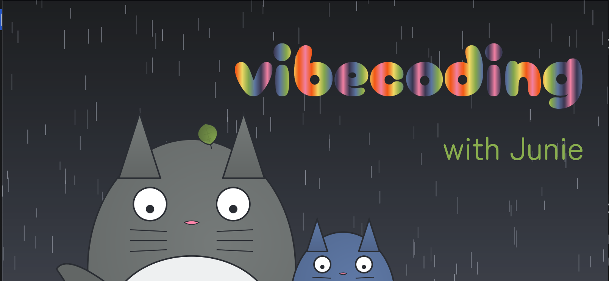

# Playdate with Totoro and Junie

A Kotlin multiplatform project exploring visual techniques through a creative tribute to Studio Ghibli's "My Neighbor Totoro". This project demonstrates various drawing and animation capabilities in Compose, creating an engaging visual experience inspired by the beloved animated film. This is also an experiment with Junie EAP. For the sake of experiment I did not touch the code. I let the agent do all of it.

## Overview

This project serves as a playground for experimenting with different visual techniques in Kotlin multiplatform using Compose. It combines various drawing methods, including:
- Canvas and custom drawing
- Shapes and geometric patterns
- Color gradients and transitions
- Text rendering and animations

## Getting Started

The project is structured to showcase different visual techniques layered together on the main composable screen. For detailed information about implementation and available techniques, please refer to our [Visual Guidelines](GUIDELINES.md).

## Visual Inspiration

The project draws inspiration from the charming world of "My Neighbor Totoro", utilizing:
- Custom color palettes reflecting the film's aesthetic
- Geometric patterns inspired by the movie's visual elements
- Creative text implementations using provided fonts
- Various drawing techniques and animations

## Resources

- Visual guidelines and technical details: [GUIDELINES.md](GUIDELINES.md)
- Color palette and style references: [docs/look/colors.md](docs/look/colors.md)
- Implementation examples: [docs/blog/wrapped2023](docs/blog/wrapped2023)

## Fonts Setup

The project requires two fonts to be added to `src/main/resources/fonts/`:

1. Zen Maru Gothic Regular
   - Download from [Google Fonts](https://fonts.google.com/specimen/Zen+Maru+Gothic)
   - Save as `ZenMaruGothic-Regular.ttf`

2. Cherry Bomb One Regular
   - Download from [Google Fonts](https://fonts.google.com/specimen/Cherry+Bomb+One)
   - Save as `CherryBombOne-Regular.ttf`

## Note

This is a creative exploration project focused on visual techniques in Kotlin multiplatform. It's designed for learning and experimentation, without any practical application beyond demonstrating interesting visual elements.
