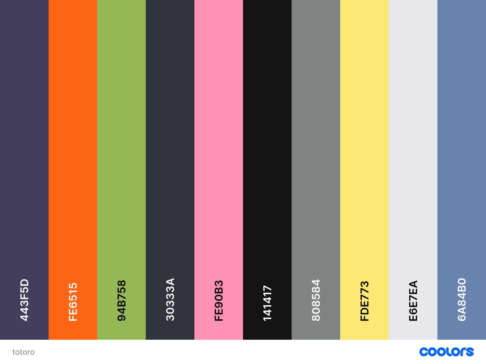

Sample code for possible colours

```xml
<palette>
    <color name="English Violet" hex="443F5D" r="68" g="63" b="93"/>
    <color name="Orange (Pantone)" hex="FE6515" r="254" g="101" b="21"/>
    <color name="Olivine" hex="94B758" r="148" g="183" b="88"/>
    <color name="Onyx" hex="30333A" r="48" g="51" b="58"/>
    <color name="Baker-Miller pink" hex="FE90B3" r="254" g="144" b="179"/>
    <color name="Night" hex="141417" r="20" g="20" b="23"/>
    <color name="Battleship gray" hex="808584" r="128" g="133" b="132"/>
    <color name="Jasmine" hex="FDE773" r="253" g="231" b="115"/>
    <color name="Platinum" hex="E6E7EA" r="230" g="231" b="234"/>
    <color name="Glaucous" hex="6A84B0" r="106" g="132" b="176"/>
</palette>
```


.jpg)
